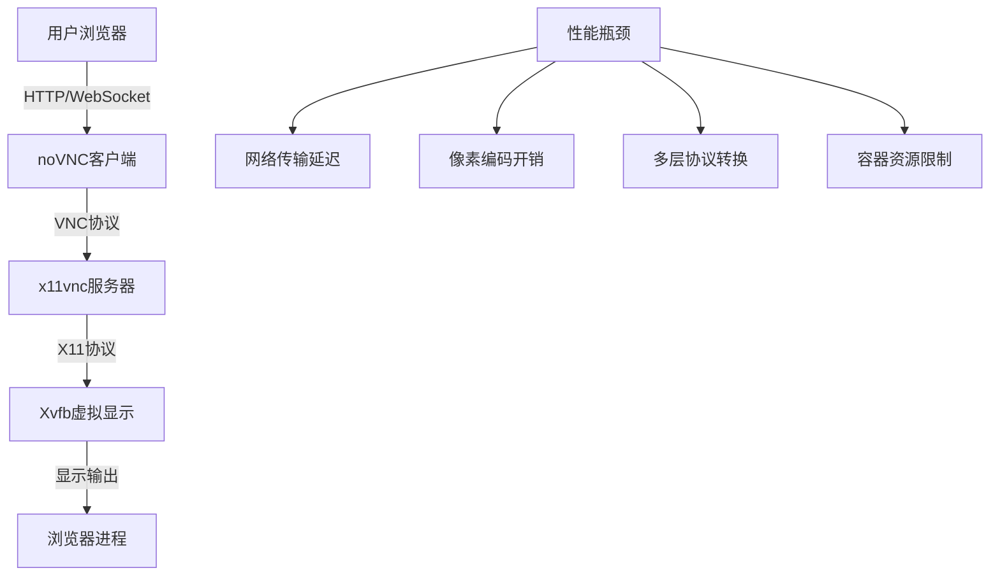
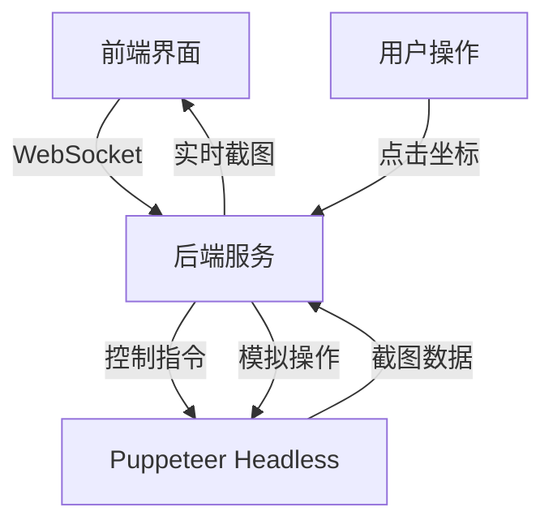

# 智能寻聘VNC服务性能优化与替代方案

## 1. 问题分析

### 1.1 当前架构问题

#### VNC服务卡顿的根本原因
1. **网络延迟**：VNC协议基于像素级传输，对网络带宽要求高
2. **编码效率**：noVNC使用的编码算法在复杂界面下性能不佳
3. **资源竞争**：容器环境下CPU和内存资源有限
4. **显示刷新**：1920x1080分辨率下刷新频率过高

#### 浏览器初始化问题
1. **启动顺序**：VNC服务和浏览器启动时序不当
2. **环境变量**：DISPLAY变量配置不稳定
3. **权限问题**：容器内用户权限限制
4. **依赖冲突**：Puppeteer和系统浏览器版本不匹配

### 1.2 性能瓶颈分析



## 2. 优化方案

### 2.1 VNC服务优化

#### 分辨率和编码优化
```bash
# 优化VNC分辨率配置
VNC_RESOLUTION=1280x720  # 降低分辨率减少传输数据
VNC_QUALITY=6           # 调整压缩质量平衡
VNC_COMPRESS_LEVEL=9    # 最高压缩级别
```

#### x11vnc参数优化
```bash
# 优化的x11vnc启动参数
x11vnc -forever -usepw -create \
  -rfbauth /root/.vnc/passwd \
  -rfbport 5900 \
  -display :1 \
  -noxrecord -noxfixes -noxdamage \
  -wait 5 -shared \
  -permitfiletransfer \
  -scale 0.8 \
  -quality 60 \
  -compress 9 \
  -threads
```

#### noVNC客户端优化
```javascript
// noVNC连接优化配置
const rfb = new RFB(target, url, {
    credentials: { password: 'vnc123' },
    repeaterID: '',
    shared: true,
    wsProtocols: ['binary'],
    // 性能优化选项
    qualityLevel: 6,
    compressionLevel: 2,
    showDotCursor: false,
    viewOnly: false,
    focusOnClick: true,
    clipToWindow: false,
    dragViewport: false,
    scaleViewport: true,
    resizeSession: false
});
```

### 2.2 浏览器初始化优化

#### 启动脚本优化
```bash
#!/bin/bash
# 优化的浏览器启动脚本

# 等待X服务完全启动
while ! xdpyinfo -display :1 >/dev/null 2>&1; do
    echo "等待X服务启动..."
    sleep 2
done

# 设置环境变量
export DISPLAY=:1
export XAUTHORITY=/tmp/.X1-auth

# 创建授权文件
xauth add :1 . $(mcookie)

# 启动浏览器
chromium-browser \
    --no-sandbox \
    --disable-dev-shm-usage \
    --disable-gpu \
    --remote-debugging-port=9222 \
    --user-data-dir=/tmp/chrome-user-data \
    --disable-background-timer-throttling \
    --disable-backgrounding-occluded-windows \
    --disable-renderer-backgrounding
```

#### Supervisor配置优化
```ini
[program:browser]
command=/bin/bash -c "sleep 30 && /usr/local/bin/start-browser.sh"
environment=DISPLAY=":1",HOME="/root",USER="root",XAUTHORITY="/tmp/.X1-auth"
autorestart=true
stdout_logfile=/var/log/supervisor/browser.log
stderr_logfile=/var/log/supervisor/browser.log
priority=500
startsecs=30
startretries=5
exitcodes=0,1,2
stopwaitsecs=15
autorestart_delay=10
```

## 3. 替代方案

### 3.1 方案一：Headless + 截图流

#### 架构设计


#### 实现代码
```javascript
/**
 * 无头浏览器截图流服务
 */
class HeadlessStreamService {
  constructor() {
    this.browser = null;
    this.page = null;
    this.isStreaming = false;
    this.clients = new Set();
  }

  /**
   * 初始化无头浏览器
   */
  async initialize() {
    this.browser = await puppeteer.launch({
      headless: true,
      args: [
        '--no-sandbox',
        '--disable-dev-shm-usage',
        '--disable-gpu',
        '--disable-background-timer-throttling'
      ]
    });
    
    this.page = await this.browser.newPage();
    await this.page.setViewport({ width: 1280, height: 720 });
  }

  /**
   * 开始截图流
   */
  async startScreenStream() {
    if (this.isStreaming) return;
    
    this.isStreaming = true;
    
    const streamLoop = async () => {
      if (!this.isStreaming) return;
      
      try {
        const screenshot = await this.page.screenshot({
          type: 'jpeg',
          quality: 80,
          fullPage: false
        });
        
        // 广播截图到所有客户端
        this.broadcastScreenshot(screenshot);
        
        // 控制帧率为10fps
        setTimeout(streamLoop, 100);
      } catch (error) {
        console.error('截图失败:', error);
        setTimeout(streamLoop, 500);
      }
    };
    
    streamLoop();
  }

  /**
   * 处理用户操作
   */
  async handleUserAction(action) {
    const { type, x, y, text } = action;
    
    switch (type) {
      case 'click':
        await this.page.mouse.click(x, y);
        break;
      case 'type':
        await this.page.keyboard.type(text);
        break;
      case 'scroll':
        await this.page.mouse.wheel({ deltaY: y });
        break;
    }
  }

  /**
   * 广播截图
   */
  broadcastScreenshot(screenshot) {
    const base64 = screenshot.toString('base64');
    const message = JSON.stringify({
      type: 'screenshot',
      data: base64,
      timestamp: Date.now()
    });
    
    this.clients.forEach(client => {
      if (client.readyState === WebSocket.OPEN) {
        client.send(message);
      }
    });
  }
}
```

### 3.2 方案二：Chrome DevTools Protocol

#### 架构优势
- 直接使用Chrome的调试协议
- 更低的延迟和更高的性能
- 支持实时DOM操作

#### 实现示例
```javascript
/**
 * Chrome DevTools Protocol 远程控制服务
 */
class ChromeDevToolsService {
  constructor() {
    this.cdp = null;
    this.targetId = null;
  }

  /**
   * 连接到Chrome实例
   */
  async connect() {
    const CDP = require('chrome-remote-interface');
    
    this.cdp = await CDP({
      port: 9222,
      host: 'localhost'
    });
    
    const { Runtime, Page, Input } = this.cdp;
    
    await Runtime.enable();
    await Page.enable();
    await Input.enable();
    
    // 监听页面事件
    Page.screencastFrame((params) => {
      this.handleScreencastFrame(params);
    });
    
    // 开始屏幕录制
    await Page.startScreencast({
      format: 'jpeg',
      quality: 80,
      maxWidth: 1280,
      maxHeight: 720,
      everyNthFrame: 1
    });
  }

  /**
   * 处理屏幕帧
   */
  handleScreencastFrame(params) {
    const { data, sessionId } = params;
    
    // 确认帧接收
    this.cdp.Page.screencastFrameAck({ sessionId });
    
    // 广播帧数据
    this.broadcastFrame(data);
  }

  /**
   * 模拟用户输入
   */
  async simulateInput(action) {
    const { Input } = this.cdp;
    const { type, x, y, button, text } = action;
    
    switch (type) {
      case 'mousePressed':
        await Input.dispatchMouseEvent({
          type: 'mousePressed',
          x, y, button,
          clickCount: 1
        });
        break;
        
      case 'mouseReleased':
        await Input.dispatchMouseEvent({
          type: 'mouseReleased',
          x, y, button,
          clickCount: 1
        });
        break;
        
      case 'keyDown':
        await Input.dispatchKeyEvent({
          type: 'keyDown',
          text
        });
        break;
    }
  }
}
```

### 3.3 方案三：混合架构

#### 设计思路
- 开发环境：本地浏览器 + 远程控制
- 生产环境：Headless + 关键步骤截图
- 用户交互：智能切换显示模式

#### 配置管理
```javascript
/**
 * 智能显示模式管理器
 */
class DisplayModeManager {
  constructor() {
    this.currentMode = 'auto';
    this.performanceMetrics = {
      latency: 0,
      bandwidth: 0,
      cpuUsage: 0
    };
  }

  /**
   * 自动选择最佳显示模式
   */
  selectOptimalMode() {
    const { latency, bandwidth, cpuUsage } = this.performanceMetrics;
    
    // 高性能环境：使用VNC
    if (latency < 50 && bandwidth > 10 && cpuUsage < 70) {
      return 'vnc';
    }
    
    // 中等性能：使用截图流
    if (latency < 200 && bandwidth > 5) {
      return 'screenshot';
    }
    
    // 低性能环境：使用DevTools
    return 'devtools';
  }

  /**
   * 动态切换显示模式
   */
  async switchMode(newMode) {
    if (this.currentMode === newMode) return;
    
    console.log(`切换显示模式: ${this.currentMode} -> ${newMode}`);
    
    // 停止当前模式
    await this.stopCurrentMode();
    
    // 启动新模式
    await this.startMode(newMode);
    
    this.currentMode = newMode;
  }
}
```

## 4. 性能监控与优化

### 4.1 性能指标监控

```javascript
/**
 * 性能监控服务
 */
class PerformanceMonitor {
  constructor() {
    this.metrics = {
      frameRate: 0,
      latency: 0,
      bandwidth: 0,
      cpuUsage: 0,
      memoryUsage: 0
    };
  }

  /**
   * 监控帧率
   */
  monitorFrameRate() {
    let frameCount = 0;
    let lastTime = Date.now();
    
    setInterval(() => {
      const currentTime = Date.now();
      const elapsed = currentTime - lastTime;
      
      this.metrics.frameRate = (frameCount * 1000) / elapsed;
      
      frameCount = 0;
      lastTime = currentTime;
    }, 1000);
  }

  /**
   * 监控网络延迟
   */
  async monitorLatency() {
    const start = Date.now();
    
    try {
      await fetch('/api/ping');
      this.metrics.latency = Date.now() - start;
    } catch (error) {
      this.metrics.latency = 9999;
    }
  }

  /**
   * 获取系统资源使用情况
   */
  async getSystemMetrics() {
    const usage = process.cpuUsage();
    const memory = process.memoryUsage();
    
    this.metrics.cpuUsage = (usage.user + usage.system) / 1000000;
    this.metrics.memoryUsage = memory.heapUsed / 1024 / 1024;
  }
}
```

### 4.2 自适应质量调整

```javascript
/**
 * 自适应质量管理器
 */
class AdaptiveQualityManager {
  constructor() {
    this.currentQuality = 80;
    this.targetFrameRate = 15;
  }

  /**
   * 根据性能调整质量
   */
  adjustQuality(metrics) {
    const { frameRate, latency, cpuUsage } = metrics;
    
    // 帧率过低，降低质量
    if (frameRate < this.targetFrameRate * 0.8) {
      this.currentQuality = Math.max(30, this.currentQuality - 10);
    }
    
    // 延迟过高，降低质量
    if (latency > 200) {
      this.currentQuality = Math.max(30, this.currentQuality - 5);
    }
    
    // CPU使用率过高，降低质量
    if (cpuUsage > 80) {
      this.currentQuality = Math.max(30, this.currentQuality - 10);
    }
    
    // 性能良好，适当提升质量
    if (frameRate > this.targetFrameRate && latency < 100 && cpuUsage < 50) {
      this.currentQuality = Math.min(90, this.currentQuality + 5);
    }
    
    return this.currentQuality;
  }
}
```

## 5. 部署配置优化

### 5.1 Docker配置优化

```dockerfile
# 优化的Dockerfile
FROM ubuntu:20.04

# 设置环境变量
ENV DEBIAN_FRONTEND=noninteractive
ENV DISPLAY=:1
ENV VNC_RESOLUTION=1280x720
ENV VNC_PASSWORD=vnc123

# 安装优化的软件包
RUN apt-get update && apt-get install -y --no-install-recommends \
    # 基础包
    ca-certificates curl wget \
    # X11和VNC（最小化安装）
    xvfb x11vnc fluxbox \
    # 浏览器
    chromium-browser \
    # 清理缓存
    && rm -rf /var/lib/apt/lists/* \
    && apt-get clean

# 优化的noVNC安装
RUN git clone --depth 1 --branch v1.3.0 https://github.com/novnc/noVNC.git /opt/noVNC \
    && git clone --depth 1 https://github.com/novnc/websockify /opt/noVNC/utils/websockify \
    && ln -s /opt/noVNC/vnc.html /opt/noVNC/index.html

# 设置资源限制
RUN echo "* soft nofile 65536" >> /etc/security/limits.conf \
    && echo "* hard nofile 65536" >> /etc/security/limits.conf

# 复制优化的配置文件
COPY supervisord.conf /etc/supervisor/conf.d/
COPY start-vnc-optimized.sh /usr/local/bin/

RUN chmod +x /usr/local/bin/start-vnc-optimized.sh

EXPOSE 5900 6080

CMD ["/usr/local/bin/start-vnc-optimized.sh"]
```

### 5.2 Zeabur部署配置

```yaml
# zeabur.yaml
name: recruitment-automation

services:
  backend:
    build:
      context: ./backend
    environment:
      NODE_ENV: production
      VNC_SERVER_URL: https://vnc-service.zeabur.app
    
  frontend:
    build:
      context: ./frontend
    environment:
      REACT_APP_API_URL: https://backend.zeabur.app
      REACT_APP_VNC_URL: https://vnc-service.zeabur.app
    
  vnc-service:
    build:
      context: ./vnc-service
    environment:
      VNC_RESOLUTION: 1280x720
      VNC_PASSWORD: vnc123
      VNC_QUALITY: 6
      VNC_COMPRESS_LEVEL: 9
    resources:
      cpu: 1000m
      memory: 1Gi
    ports:
      - 6080:6080
```

## 6. 最佳实践建议

### 6.1 场景选择指南

| 场景 | 推荐方案 | 优势 | 适用条件 |
|------|----------|------|----------|
| 开发调试 | VNC服务 | 完整交互体验 | 本地网络，高带宽 |
| 生产监控 | 截图流 | 低延迟，稳定 | 自动化为主 |
| 用户演示 | DevTools | 高性能，流畅 | 现代浏览器 |
| 移动端 | 混合模式 | 自适应 | 网络条件变化 |

### 6.2 性能优化清单

- [ ] 降低VNC分辨率到1280x720
- [ ] 启用压缩和质量调整
- [ ] 优化浏览器启动参数
- [ ] 实现自适应质量管理
- [ ] 添加性能监控
- [ ] 配置资源限制
- [ ] 使用CDN加速静态资源
- [ ] 实现连接池管理

### 6.3 故障排除指南

#### 常见问题及解决方案

1. **VNC连接失败**
   ```bash
   # 检查VNC服务状态
   docker exec vnc-container ps aux | grep vnc
   
   # 检查端口占用
   netstat -tuln | grep 5900
   
   # 重启VNC服务
   docker restart vnc-container
   ```

2. **浏览器启动失败**
   ```bash
   # 检查X服务
   docker exec vnc-container xdpyinfo -display :1
   
   # 检查浏览器进程
   docker exec vnc-container ps aux | grep chrome
   
   # 清理用户数据
   docker exec vnc-container rm -rf /tmp/chrome-user-data
   ```

3. **性能问题诊断**
   ```javascript
   // 性能诊断脚本
   const diagnostics = {
     checkLatency: async () => {
       const start = Date.now();
       await fetch('/api/ping');
       return Date.now() - start;
     },
     
     checkBandwidth: async () => {
       const start = Date.now();
       const response = await fetch('/api/test-data');
       const data = await response.blob();
       const elapsed = Date.now() - start;
       return (data.size * 8) / (elapsed / 1000); // bps
     },
     
     checkCPU: () => {
       const usage = process.cpuUsage();
       return (usage.user + usage.system) / 1000000;
     }
   };
   ```

## 7. 总结

通过以上分析和优化方案，可以显著改善智能寻聘系统在Zeabur部署环境下的用户体验。建议采用混合架构方案，根据实际网络条件和性能要求动态选择最适合的显示模式，同时实施性能监控和自适应优化，确保系统在各种环境下都能提供良好的用户体验。