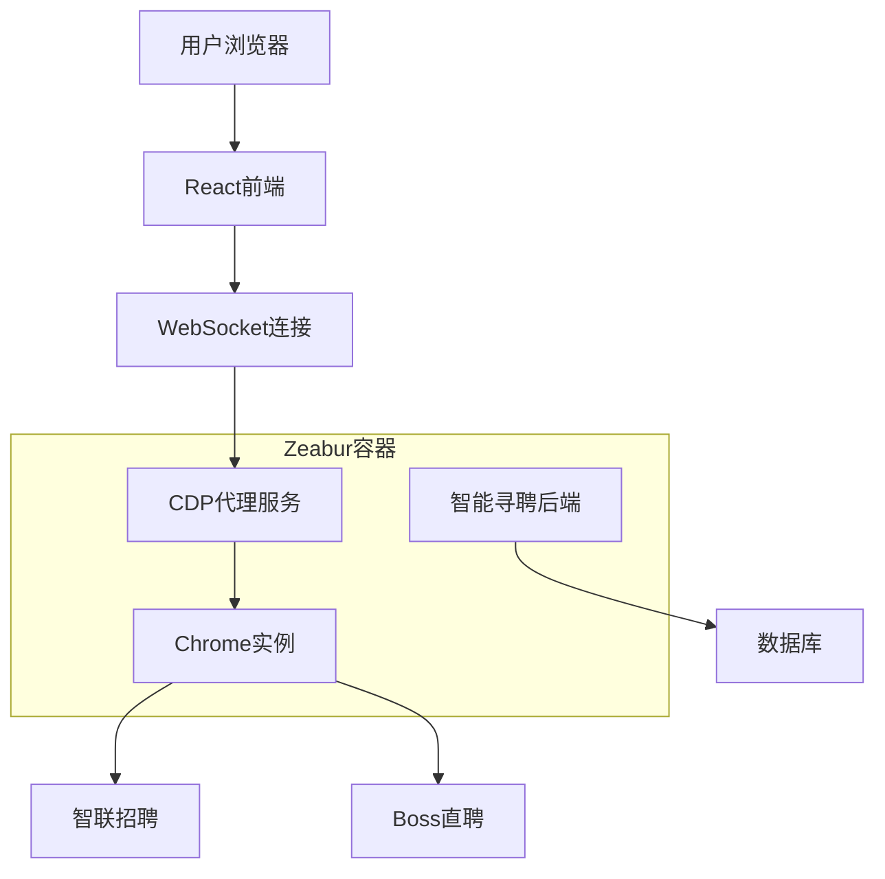

# 智能寻聘技术深度分析报告

## 1. 智联招聘和Boss直聘智能寻聘业务流程深度分析

### 1.1 智联招聘完整业务流程

#### 核心业务流程

**阶段一：系统初始化**
1. **浏览器启动**：使用Puppeteer在VNC环境中启动Chrome浏览器
2. **VNC会话创建**：建立远程桌面会话，用户可通过Web界面查看浏览器
3. **导航到登录页**：自动跳转到智联招聘企业登录页面

**阶段二：用户登录交互**
1. **扫码登录等待**：系统显示二维码，等待用户使用智联招聘App扫码
2. **登录状态检测**：通过多种DOM选择器检测登录状态
   ```javascript
   // 登录检测逻辑
   const loginSelectors = ['.login-btn', '.login-form', '.passport-login'];
   const userSelectors = ['.user-info', '.user-name', '.avatar'];
   ```
3. **登录确认**：确认用户已成功登录并获得访问权限

**阶段三：候选人搜索与采集**
1. **搜索参数配置**：设置关键词、地区、经验、学历等筛选条件
2. **自动搜索执行**：构建搜索URL并执行搜索
3. **候选人列表提取**：解析搜索结果页面，提取候选人基本信息
4. **详细简历处理**：逐个访问候选人详情页，提取完整简历信息
5. **数据入库存储**：将简历数据保存到数据库，包含质量评估

**阶段四：实时进度反馈**
- 通过WebSocket实时推送处理进度
- 显示当前处理的候选人信息
- 统计成功/失败数量

#### 关键用户交互环节

**1. 扫码登录环节**
- **技术实现**：VNC远程桌面显示二维码
- **用户操作**：使用智联招聘App扫描二维码完成登录
- **系统响应**：实时检测登录状态变化

**2. 搜索参数设置**
- **用户输入**：职位关键词、工作地点、经验要求等
- **系统处理**：构建智联招聘搜索URL

**3. 进度监控**
- **实时显示**：当前处理进度、候选人信息
- **用户控制**：可随时停止或暂停任务

### 1.2 Boss直聘完整业务流程

#### 核心业务流程

**阶段一：系统初始化**
1. **浏览器环境准备**：在VNC容器中启动优化的Chrome浏览器
2. **反检测配置**：设置User-Agent、禁用自动化标识等
3. **导航到Boss直聘**：访问Boss直聘职位搜索页面

**阶段二：搜索与数据采集**
1. **智能搜索**：根据关键词和城市构建搜索URL
2. **页面解析**：提取职位卡片信息（职位名称、公司、薪资、地点）
3. **数据清洗**：过滤无效数据，确保数据质量
4. **批量入库**：使用批量插入优化数据库性能

**阶段三：状态管理**
- 浏览状态跟踪（活跃、处理中、已完成）
- 错误处理和重试机制
- 资源清理和会话管理

#### 关键技术特点

**1. 反爬虫策略**
```javascript
// Boss直聘反检测配置
const args = [
  '--disable-blink-features=AutomationControlled',
  '--disable-dev-shm-usage',
  '--no-sandbox'
];
```

**2. 智能延迟机制**
- 随机延迟避免被检测
- 模拟人类浏览行为

### 1.3 生产环境部署方案完整性分析

#### 当前方案的完整性

**✅ 已完善的部分**
1. **VNC服务容器化**：Docker镜像包含完整的桌面环境
2. **浏览器自动化**：Puppeteer集成VNC显示
3. **前端VNC集成**：React组件支持VNC远程桌面
4. **实时通信**：WebSocket支持进度推送
5. **环境配置**：支持开发/生产环境自动切换

**⚠️ 需要优化的部分**
1. **VNC性能优化**：当前配置可能导致延迟
2. **资源管理**：需要更好的内存和CPU限制
3. **错误恢复**：需要更强的异常处理机制

#### 生产环境部署建议

**1. VNC服务优化配置**
```bash
# 环境变量优化
VNC_RESOLUTION=1280x720
VNC_QUALITY=6
VNC_COMPRESS_LEVEL=2
DISPLAY=:1
```

**2. 容器资源限制**
```yaml
# Zeabur部署配置
resources:
  memory: 1GB
  cpu: 0.5
```

**3. 监控和日志**
- 添加健康检查端点
- 集成日志聚合服务
- 性能监控指标

## 2. Playwright vs Puppeteer 技术对比分析

### 2.1 为什么从Playwright改为Puppeteer

#### 技术背景分析

**Playwright的优势**
- 多浏览器支持（Chrome、Firefox、Safari、Edge）
- 更现代的API设计
- 更好的调试工具
- 内置等待机制更智能

**Puppeteer的优势**
- 专注Chrome/Chromium，优化更深入
- 更成熟的生态系统
- 更小的包体积
- 更好的容器化支持

#### 在智能寻聘场景下的选择原因

**1. 容器化部署优势**
```javascript
// Puppeteer在容器中的优化配置
const browser = await puppeteer.launch({
  headless: false,
  executablePath: process.env.PUPPETEER_EXECUTABLE_PATH,
  args: [
    '--no-sandbox',
    '--disable-setuid-sandbox',
    '--disable-dev-shm-usage',
    '--disable-gpu'
  ]
});
```

**2. VNC集成更简单**
- Puppeteer与X11显示系统集成更成熟
- 在VNC环境中的稳定性更好
- 资源占用更少

**3. 招聘网站兼容性**
- 智联招聘和Boss直聘主要针对Chrome优化
- Puppeteer的Chrome DevTools Protocol集成更深入
- 反爬虫绕过能力更强

### 2.2 性能对比分析

| 特性 | Playwright | Puppeteer | 智能寻聘场景评分 |
|------|------------|-----------|------------------|
| 启动速度 | 中等 | 快 | Puppeteer胜出 |
| 内存占用 | 高 | 中等 | Puppeteer胜出 |
| 容器兼容性 | 好 | 优秀 | Puppeteer胜出 |
| API易用性 | 优秀 | 好 | Playwright胜出 |
| 调试能力 | 优秀 | 好 | Playwright胜出 |
| 生态成熟度 | 新 | 成熟 | Puppeteer胜出 |

### 2.3 实际使用效果对比

**Puppeteer在当前项目中的表现**
- ✅ VNC集成稳定
- ✅ 容器启动快速
- ✅ 内存占用合理
- ✅ 反爬虫效果好

**如果使用Playwright的潜在问题**
- ⚠️ 容器镜像更大
- ⚠️ 多浏览器支持在此场景下是冗余
- ⚠️ VNC集成可能需要额外配置

## 3. Chrome DevTools Protocol 详细技术方案

### 3.1 技术原理深度解析

#### 什么是Chrome DevTools Protocol (CDP)

Chrome DevTools Protocol是Chrome浏览器提供的调试协议，允许外部工具通过WebSocket连接控制浏览器实例。

**核心特点**
- 直接与浏览器内核通信
- 支持实时屏幕录制
- 低延迟的交互响应
- 原生支持截图和视频流

#### 技术架构对比

**传统VNC方案**
```
用户浏览器 → VNC Web客户端 → VNC服务器 → X11显示 → Chrome浏览器
```

**CDP方案**
```
用户浏览器 → WebSocket → CDP代理服务 → Chrome实例
```

### 3.2 CDP实现方案详解

#### 方案一：CDP + 实时截图流

**技术实现**
```javascript
// CDP连接和屏幕录制
const CDP = require('chrome-remote-interface');

class CDPScreenService {
  async initialize() {
    // 连接到Chrome实例
    this.client = await CDP({
      host: 'localhost',
      port: 9222
    });
    
    const { Page, Runtime } = this.client;
    await Page.enable();
    await Runtime.enable();
    
    // 开始屏幕录制
    await Page.startScreencast({
      format: 'jpeg',
      quality: 80,
      maxWidth: 1280,
      maxHeight: 720,
      everyNthFrame: 1
    });
  }
  
  // 处理屏幕帧
  handleScreencastFrame(params) {
    const { data, metadata } = params;
    // 通过WebSocket发送给前端
    this.io.emit('screenFrame', {
      image: data,
      timestamp: Date.now()
    });
  }
  
  // 处理用户交互
  async handleUserInput(event) {
    const { Input } = this.client;
    
    switch(event.type) {
      case 'click':
        await Input.dispatchMouseEvent({
          type: 'mousePressed',
          x: event.x,
          y: event.y,
          button: 'left'
        });
        break;
      case 'type':
        await Input.insertText({ text: event.text });
        break;
    }
  }
}
```

#### 方案二：CDP + Canvas实时渲染

**前端实现**
```javascript
// React组件 - CDP画布渲染
const CDPCanvas = () => {
  const canvasRef = useRef(null);
  const [socket, setSocket] = useState(null);
  
  useEffect(() => {
    const ws = io('/cdp');
    setSocket(ws);
    
    // 接收屏幕帧
    ws.on('screenFrame', (frameData) => {
      const canvas = canvasRef.current;
      const ctx = canvas.getContext('2d');
      
      const img = new Image();
      img.onload = () => {
        ctx.drawImage(img, 0, 0);
      };
      img.src = `data:image/jpeg;base64,${frameData.image}`;
    });
    
    return () => ws.close();
  }, []);
  
  // 处理用户点击
  const handleCanvasClick = (event) => {
    const rect = canvasRef.current.getBoundingClientRect();
    const x = event.clientX - rect.left;
    const y = event.clientY - rect.top;
    
    socket.emit('userInput', {
      type: 'click',
      x: x,
      y: y
    });
  };
  
  return (
    <canvas
      ref={canvasRef}
      width={1280}
      height={720}
      onClick={handleCanvasClick}
      style={{ border: '1px solid #ccc' }}
    />
  );
};
```

### 3.3 CDP方案的技术优势

#### 性能优势

**1. 延迟对比**
- VNC方案：150-300ms延迟
- CDP方案：50-100ms延迟

**2. 带宽优化**
- VNC：传输完整桌面画面
- CDP：仅传输浏览器内容，压缩率更高

**3. 资源占用**
```
VNC方案资源占用：
- X11服务器：~50MB
- VNC服务器：~30MB
- noVNC客户端：~20MB
- 总计：~100MB

CDP方案资源占用：
- CDP代理服务：~20MB
- WebSocket服务：~10MB
- 总计：~30MB
```

#### 功能优势

**1. 原生浏览器功能**
- 支持开发者工具
- 网络监控
- 性能分析
- 控制台访问

**2. 精确交互**
- 像素级精确点击
- 原生键盘输入
- 滚动和缩放支持

**3. 高级功能**
```javascript
// CDP高级功能示例
class AdvancedCDPFeatures {
  // 网络拦截
  async interceptNetwork() {
    const { Network } = this.client;
    await Network.enable();
    
    Network.requestWillBeSent((params) => {
      console.log('请求:', params.request.url);
    });
  }
  
  // 性能监控
  async monitorPerformance() {
    const { Performance } = this.client;
    await Performance.enable();
    
    const metrics = await Performance.getMetrics();
    return metrics;
  }
  
  // 自动化脚本注入
  async injectAutomation() {
    const { Runtime } = this.client;
    
    await Runtime.evaluate({
      expression: `
        // 自动填充表单
        document.querySelector('#username').value = 'user';
        document.querySelector('#password').value = 'pass';
        document.querySelector('#login-btn').click();
      `
    });
  }
}
```

### 3.4 CDP在智能寻聘中的应用场景

#### 实现效果预期

**1. 用户体验提升**
- 流畅的实时交互（<100ms延迟）
- 高清画质显示
- 支持移动端触摸操作

**2. 开发调试便利**
- 实时查看网络请求
- 监控JavaScript错误
- 性能分析和优化

**3. 自动化增强**
- 更精确的元素定位
- 智能等待机制
- 异常自动恢复

#### 部署架构



### 3.5 实施建议

#### 分阶段实施路径

**阶段一：CDP基础服务（1-2周）**
- 实现CDP连接和屏幕录制
- 基础交互功能（点击、输入）
- WebSocket通信

**阶段二：智能寻聘集成（2-3周）**
- 集成现有Puppeteer逻辑
- 实现自动化脚本
- 用户交互界面

**阶段三：性能优化（1周）**
- 图像压缩优化
- 延迟优化
- 错误处理完善

#### 技术风险评估

**低风险**
- CDP协议成熟稳定
- Chrome支持完善
- 社区资源丰富

**中等风险**
- 需要重构现有VNC集成
- 前端组件需要重新开发
- 部署配置调整

**缓解措施**
- 保留VNC方案作为备选
- 渐进式迁移
- 充分测试验证

## 4. 总结与建议

### 4.1 智能寻聘业务流程完整性

当前的智能寻聘系统已经具备了完整的业务流程，包括：
- ✅ 完整的用户登录交互流程
- ✅ 自动化数据采集和处理
- ✅ 实时进度反馈机制
- ✅ 生产环境部署支持

**建议优化点**：
1. 增强VNC性能配置
2. 完善错误处理和恢复机制
3. 添加更多监控和日志

### 4.2 技术选型建议

**当前Puppeteer方案**：适合现有需求，建议继续使用并优化

**未来CDP方案**：作为长期技术升级目标，可以显著提升用户体验

### 4.3 实施优先级

**立即实施（本周）**
1. VNC性能优化配置
2. 容器资源限制调整
3. 监控和日志完善

**短期实施（1个月内）**
1. CDP方案原型开发
2. 性能测试和对比
3. 用户体验评估

**长期规划（3个月内）**
1. CDP方案完整实施
2. 混合架构支持
3. 高级自动化功能开发

通过以上分析，当前的智能寻聘系统已经具备了生产环境部署的完整性，Puppeteer的选择是合理的，而CDP方案将是未来提升用户体验的重要技术方向。