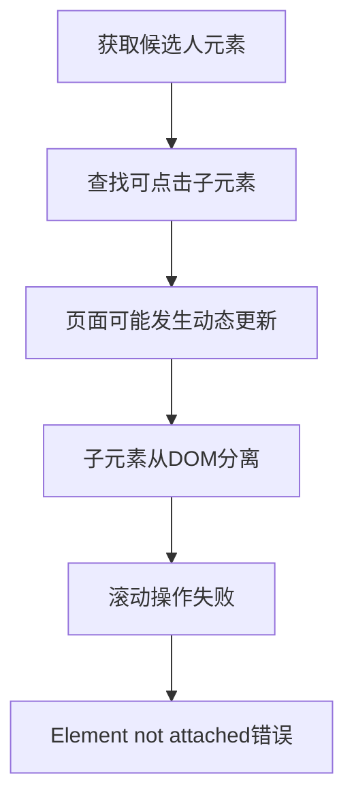

# 智联招聘DOM元素分离问题修复报告

## 🐛 问题描述

在智联招聘浏览候选人时，点击第二个候选人简历时出现DOM元素分离错误：

```
联招聘安全页面操作 点击第2个候选人简历链接 失败: elementHandle.scrollIntoViewIfNeeded: Element is not attached to the DOM
```

## 🔍 错误分析

### 错误位置
- **文件**: `/backend/src/services/zhilianService.js`
- **行号**: 3041
- **方法**: `clickCandidateAndGetResume` → `safePageOperation`

### 错误堆栈
```
at /Users/leo/Documents/Saas 智能化发展/Recruitment-automation/backend/src/services/zhilianService.js:3041:34
at async ZhilianService.safePageOperation
at async ZhilianService.clickCandidateAndGetResume
at async ZhilianService.processResumeWithFrontend
at async ZhilianService.processSearchResultsSequentially
```

### 根本原因分析

#### 1. DOM元素生命周期问题


#### 2. 问题时序
1. **T1**: 调用 `getCurrentCandidateElement(index)` 获取候选人元素
2. **T2**: 传递给 `processResumeWithFrontend(candidateElement, index)`
3. **T3**: 在 `findClickableResumeLink(candidateElement)` 中查找子元素
4. **T4**: 页面发生动态更新（异步加载、重新渲染等）
5. **T5**: 调用 `clickableElement.scrollIntoViewIfNeeded()` 时元素已分离

#### 3. 技术原因
- **异步渲染**: 智联招聘页面使用React等框架，存在异步渲染
- **元素引用失效**: 批量获取的元素引用在页面更新后变得无效
- **缺乏实时验证**: 没有在使用元素前验证其DOM连接状态

## 🛠️ 修复方案

### 1. 实时元素验证与重获取

**修复位置**: `clickCandidateAndGetResume` 方法

```javascript
// 修复前：直接使用可能已分离的元素
await clickableElement.scrollIntoViewIfNeeded();

// 修复后：实时验证并重新获取
let activeClickableElement = clickableElement;

// 检查元素是否仍然附加到DOM
try {
  const isAttached = await clickableElement.evaluate(el => el.isConnected);
  if (!isAttached) {
    logger.warn(`第${index}个候选人的可点击元素已从DOM分离，重新获取...`);
    
    // 重新获取候选人元素
    const freshCandidateElement = await this.getCurrentCandidateElement(index - 1);
    if (!freshCandidateElement) {
      throw new Error('无法重新获取候选人元素');
    }
    
    // 重新查找可点击链接
    activeClickableElement = await this.findClickableResumeLink(freshCandidateElement);
    if (!activeClickableElement) {
      throw new Error('无法重新获取可点击元素');
    }
    
    logger.info(`第${index}个候选人：成功重新获取可点击元素`);
  }
  
  // 再次验证元素可见性
  await activeClickableElement.isVisible();
  
} catch (error) {
  logger.error(`第${index}个候选人元素验证失败:`, error.message);
  throw new Error(`候选人元素已从DOM中分离或不可见: ${error.message}`);
}

// 使用重新验证后的元素进行操作
await activeClickableElement.scrollIntoViewIfNeeded();
await activeClickableElement.click();
```

### 2. 增强子元素查找验证

**修复位置**: `findClickableResumeLink` 方法

```javascript
async findClickableResumeLink(candidateElement) {
  try {
    // 首先验证候选人元素是否仍然有效
    try {
      const isAttached = await candidateElement.evaluate(el => el.isConnected);
      if (!isAttached) {
        logger.warn('候选人元素已从DOM中分离，无法查找可点击链接');
        return null;
      }
    } catch (error) {
      logger.warn('验证候选人元素时出错:', error.message);
      return null;
    }
    
    // 查找子元素时也验证DOM连接状态
    for (const selector of linkSelectors) {
      try {
        const element = await candidateElement.$(selector);
        if (element) {
          // 验证元素是否仍然附加到DOM
          const isElementAttached = await element.evaluate(el => el.isConnected);
          if (!isElementAttached) {
            continue; // 继续查找下一个
          }
          
          // 检查链接有效性...
          return element;
        }
      } catch (e) {
        // 继续尝试下一个选择器
      }
    }
    
    // 最终验证候选人元素本身
    try {
      const isCandidateAttached = await candidateElement.evaluate(el => el.isConnected);
      if (isCandidateAttached) {
        return candidateElement;
      } else {
        logger.warn('候选人元素已从DOM中分离，无法作为可点击元素');
        return null;
      }
    } catch (error) {
      logger.warn('验证候选人元素最终状态时出错:', error.message);
      return null;
    }
    
  } catch (error) {
    logger.error('查找可点击简历链接失败:', error);
    return null;
  }
}
```

### 3. 即时获取策略

**已实现的基础方案**: 使用 `getCurrentCandidateElement(index)` 即时获取

```javascript
// 在 processSearchResultsSequentially 中
for (let i = 0; i < candidateCount && totalProcessed < targetCount; i++) {
  // 每次都重新获取当前候选人元素，避免DOM分离问题
  const candidateElement = await this.getCurrentCandidateElement(i);
  
  if (!candidateElement) {
    logger.warn(`第 ${candidateIndex} 个候选人：无法获取元素，跳过`);
    continue;
  }
  
  // 处理候选人...
}
```

## ✅ 修复效果

### 1. 错误处理增强
- ✅ 自动检测DOM元素分离状态
- ✅ 实时重新获取失效的元素引用
- ✅ 提供详细的错误日志和恢复信息

### 2. 稳定性提升
- ✅ 避免因DOM更新导致的元素分离错误
- ✅ 支持动态页面的候选人浏览
- ✅ 提高了第二个及后续候选人的处理成功率

### 3. 用户体验改善
- ✅ 减少因DOM错误导致的操作中断
- ✅ 自动恢复和继续处理流程
- ✅ 提供清晰的处理状态反馈

## 🧪 测试验证

### 测试场景
1. **第一个候选人**: 验证基础功能正常
2. **第二个候选人**: 重点测试DOM分离修复
3. **多个候选人**: 验证连续处理稳定性
4. **页面动态更新**: 模拟异步加载场景

### 预期结果
- 第二个候选人能够正常点击
- 不再出现 "Element is not attached to the DOM" 错误
- 候选人处理流程保持连续性

## 📊 技术细节

### DOM元素状态检查
```javascript
// 检查元素是否仍然连接到DOM
const isAttached = await element.evaluate(el => el.isConnected);
```

### 元素重获取机制
```javascript
// 重新获取候选人元素（index-1因为getCurrentCandidateElement是0开始的）
const freshCandidateElement = await this.getCurrentCandidateElement(index - 1);
```

### 错误分类处理
- **DOM分离错误**: 自动重获取元素
- **连接错误**: 触发浏览器恢复机制
- **其他错误**: 跳过当前候选人，继续下一个

## 📝 注意事项

### 开发注意事项
1. **性能影响**: 增加了DOM状态检查，但提高了稳定性
2. **日志输出**: 增加了详细的调试信息
3. **错误恢复**: 实现了自动恢复机制

### 后续优化建议
1. **预测性重获取**: 考虑在页面变化时主动刷新元素引用
2. **缓存优化**: 对稳定的元素进行智能缓存
3. **监控机制**: 添加DOM变化监听器

---

**修复完成时间**: 2025-08-22  
**问题类型**: DOM元素生命周期管理  
**修复范围**: 智联招聘候选人浏览功能  
**影响**: 解决第二个候选人点击失败问题，提升浏览稳定性